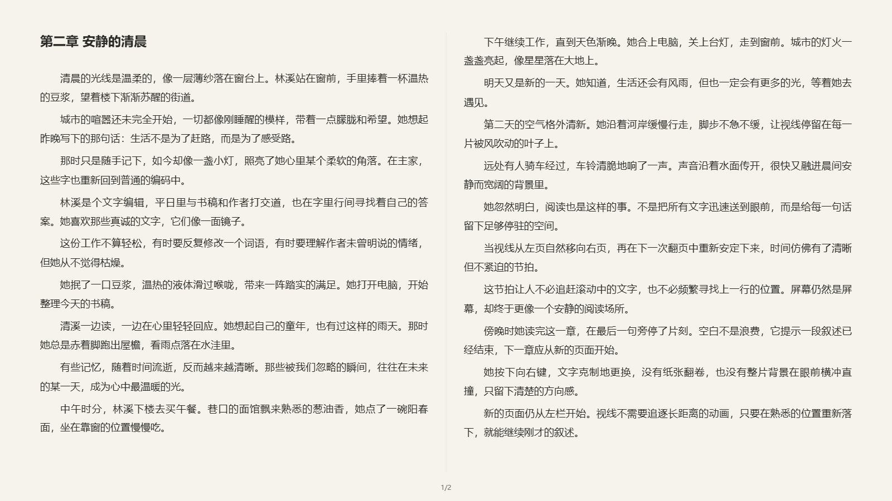
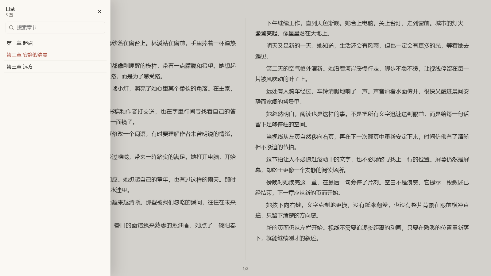
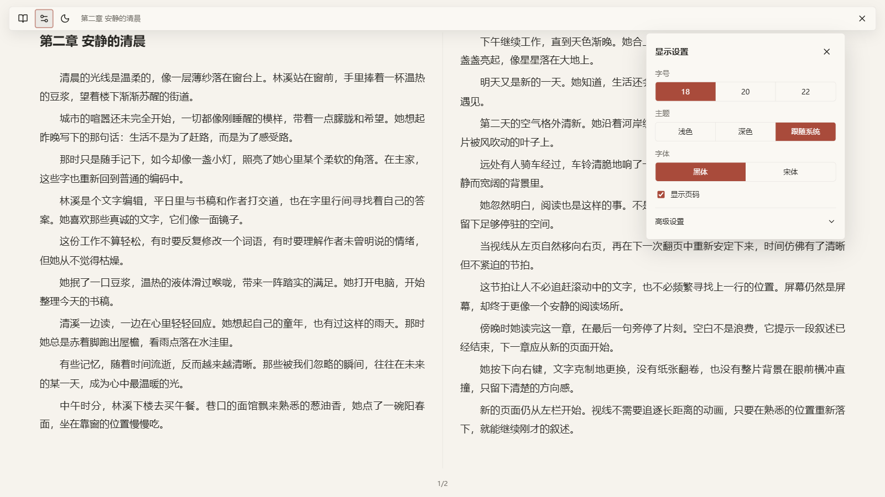
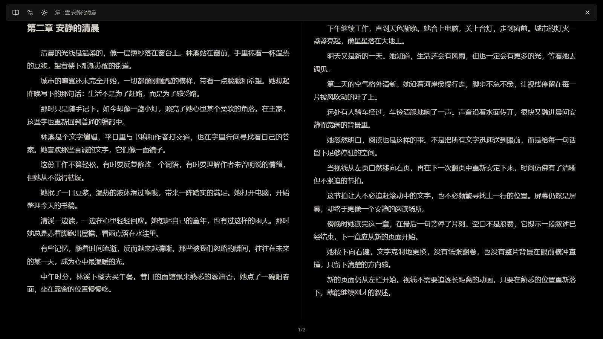
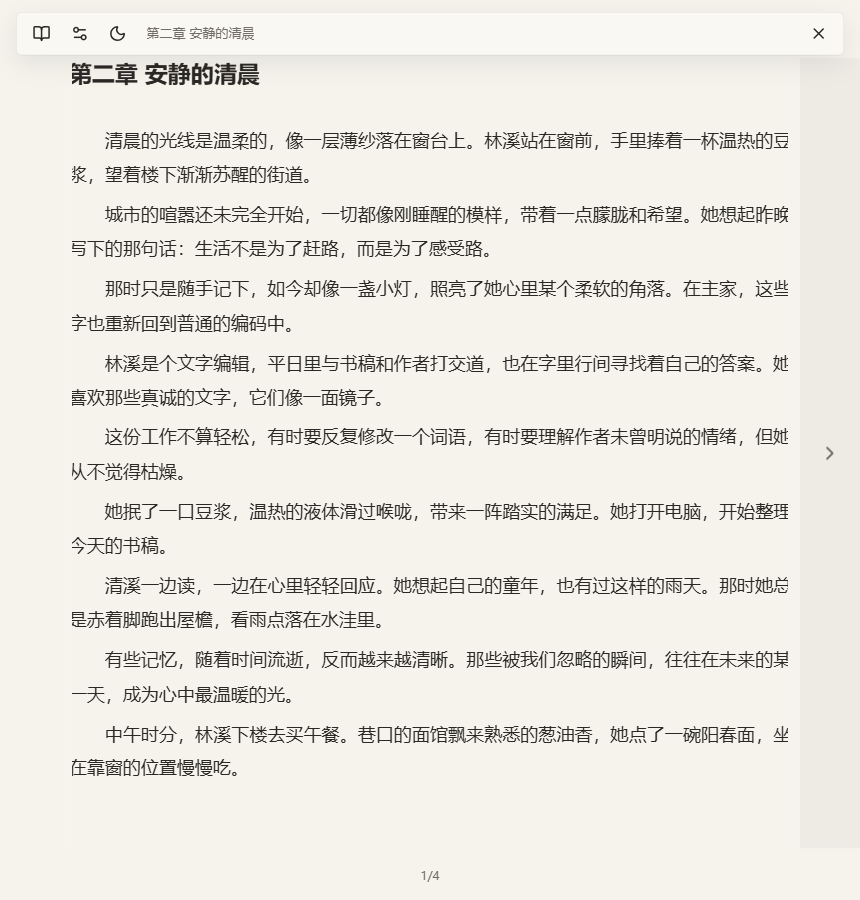

# 番茄小说宽屏阅读

[](https://github.com/Zane-0x5a/tomato-wide-reader/actions/workflows/ci.yml)
[](https://github.com/Zane-0x5a/tomato-wide-reader/releases/latest)
[](LICENSE)

把番茄小说的网页阅读器变成**整屏固定视口的双栏翻页阅读器**。不再滚动，不再窄栏，长时间读也不累。

Edge / Chromium Manifest V3 扩展。



> **非官方项目。** 与番茄小说及其运营方无任何隶属、赞助或背书关系。本扩展只改变已经交付到浏览器的网页内容的呈现方式，不提供内容、不绕过登录或付费、不下载或导出书籍。「番茄小说」为其权利人的商标，此处仅用于说明本扩展适配的站点。
>
> 截图使用项目自带的测试夹具文本，非任何作品正文。

## 它解决什么

番茄小说的网页版把正文塞在一根窄柱里，要一直往下滚。屏幕越宽，浪费越多，眼睛横向扫过的距离却没变短。

这个扩展把同一段正文折成左右两栏、铺满整个视口，用**翻页**代替滚动：

- **双栏 spread** —— 可用宽度足够时左右两栏作为一个整体翻页，宽度不足自动回退单栏，**不会缩小你的字号**。
- **翻页而非滚动** —— 点击左右外侧留白、`←/→`、`PageUp/PageDown`、滚轮、触控板都能翻页。滚轮要积累到明确手势才翻一页，小幅噪声不会误触。
- **位置不丢** —— 换窗口尺寸、缩放、字体、栏数时，靠语义锚点（章节 ID + 正文块 ID + 字符偏移）保住你当前读到的位置，而不是靠页码。
- **连续跨章** —— 章节之间直接翻过去，没有确认页；只预取相邻的一章。
- **安静的界面** —— 闲置时屏幕上几乎只有正文和一个页码。控制层靠近边缘才出现。App 下载二维码、推广、打赏入口一律不呈现。

| 目录抽屉 | 排版与主题 |
|---|---|
|  |  |
| **深色主题** | **窄窗口回退单栏** |
|  |  |

可搜索的全高目录会标出当前章节；排版设置提供快捷预设与可展开的细调；深浅色主题都按护眼取值，没有纯黑纯白的刺眼对比。

## 安装

**从 Release 安装（推荐）**

1. 在 [Releases](https://github.com/Zane-0x5a/tomato-wide-reader/releases) 下载最新的 `.zip` 并解压。
2. 打开 `edge://extensions`，启用「开发人员模式」。
3. 点击「加载解压缩的扩展」，选择解压出来的目录。
4. 打开受支持的 `https://fanqienovel.com/reader/...` 页面，扩展会自动启动。

**从源码构建**

```powershell
npm install
node tools/make-icons.mjs
npm run check     # typecheck + 测试 + 构建
```

构建产物在 `.output/chrome-mv3`，`npm run zip` 可生成上架用的压缩包。

## 隐私

只在 `https://fanqienovel.com/reader/*` 运行，权限只有 `storage` 和这一条 host 权限。

不上传正文、账户信息、Cookie、令牌或诊断；仅用扩展本地存储保存显示设置和阅读位置；不导出、下载或批量抓取书籍。登录、内容权限、章节导航与账户级阅读进度仍然由番茄原网页负责。卸载扩展即移除本地存储。

完整说明见 [PRIVACY.md](PRIVACY.md)。

## 内容边界

扩展只改变网页中**已经交付给浏览器**的内容的呈现，不绕过登录、付费、DRM 或 App 专属交付。出版读物 VIP 目前不受支持，因为番茄网页服务没有返回正文。

如果扩展无法验证正文完整性，它会保留原网页并显示一个可关闭的诊断，而不是展示一个看起来漂亮却缺段落的阅读器。

## 文档

- [SPEC.md](SPEC.md) —— 产品规格、原则与能力边界
- [DESIGN_SYSTEM.md](DESIGN_SYSTEM.md) —— 配色、排版与动效规范
- [IMPLEMENTATION_PLAN.md](IMPLEMENTATION_PLAN.md) —— 实现计划

## 许可

[MIT](LICENSE)
